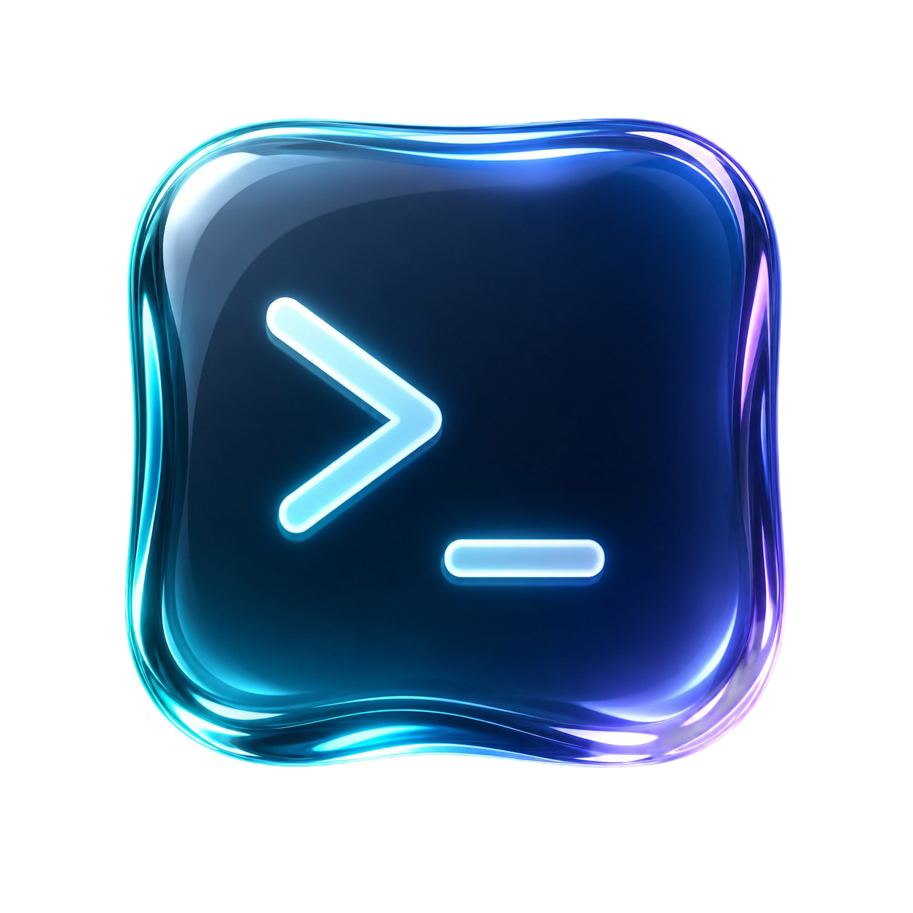

<p align="center">
  
</p>

# Frost Glass: a frosted look for Windows Terminal


> Frosted, translucent glass for cmd / PowerShell / WSL. Acrylic blur, a cool luminous palette, and a rounded-capsule Oh My Posh prompt. One installer, fully reversible.

[](LICENSE)


<!-- Hero image: capture with ScreenToGif, save it as assets/hero.png (a GIF is even
     better) showing `cd` into a git repo + a command so the capsules and colors are
     visible, then uncomment the line below:

-->


A small, self-contained codebase that turns cmd / PowerShell / WSL in
**Windows Terminal** into a frosted, translucent glass surface: acrylic blur, a
cool desaturated luminous palette, and a rounded-capsule Oh My Posh prompt.

> **Scope, honestly:** this is **frosted glass**, not true *liquid glass*. A
> terminal theme can't do refraction, lens distortion, or pointer-reactive
> highlights; those are compositor/shader effects the OS doesn't expose to Windows
> Terminal. What you *can* get natively is the frosted read: **acrylic blur** of
> whatever's behind the window, transparency, layered title/tab depth, and a
> palette + prompt tuned to look like backlit glass. That's Frost Glass, and it's a
> genuinely polished terminal. Chasing the real optical material means owning the
> window, which is what the companion **Liquid Glass** app (a native WinUI/Win32
> experiment) explores, not this theme.

## What's fixed

This pass hardened the installer so the look actually lands on a real, modern
Windows 11 + Windows Terminal setup:

- **Font no longer renders as tofu boxes.** `font.face` now matches the family the
  Nerd Font actually registers (`CaskaydiaCove NF`, per Nerd Fonts v3) instead of
  the never-installed `"CascadiaCove/CaskaydiaCove Nerd Font"`. The installer
  derives the real name straight from the downloaded font file.
- **The font installs *and registers* reliably.** The dead winget id
  `DEVCOM.NerdFonts.CaskaydiaCove` is replaced with a download from the Nerd Fonts
  release. Each face is registered under a unique key (keying by family name
  silently dropped most styles) and Windows is notified via `AddFontResource` +
  `WM_FONTCHANGE`, so Windows Terminal finds the font immediately instead of
  erroring with *"Unable to find the following fonts"* until the next sign-in.
- **`Ctrl+Shift+Up/Down` opacity nudge works again.** Written in Windows Terminal
  1.22+'s split `actions` + `keybindings` schema with distinct ids, so WT no longer
  collapses the `+5`/`-5` deltas into one dead action on its next save.
- **Fresh machines work.** The installer now creates/merges `settings.json` even
  when Windows Terminal has never generated one, instead of bailing.
- **No more red errors at shell start.** Dropped the removed `Enable-PoshTransientPrompt`
  cmdlet (oh-my-posh v29 ships transient prompt via the theme) and guarded
  PSReadLine predictions on non-interactive/redirected hosts.
- **Mica is off by default.** On Windows 11, WT's Mica backdrop paints a near-solid
  desktop tint that *suppresses* the acrylic desktop-blur, so the window ends up
  looking flat, not frosted. Acrylic alone gives the real glass. (Flip it back on
  in `themes[].window.useMica` if you prefer the subtle Mica tint.)
- **Frostier and punchier.** Default opacity is 50 (more see-through frost) with
  10 px uniform padding, and the palette accents were saturated up. A faint backlit
  sheen (`assets/sheen.png`) ships bundled but is **off** in the default look;
  toggle it live in the customizer.
- **Live customizer.** `customize.ps1` / `Customize.cmd`, a WinForms panel that
  edits `settings.json` in real time (opacity, blur, font size, padding, backlight
  sheen, pitch-black, presets, and a one-click **Reset to Default**). It writes
  `settings.json` atomically (temp file + swap) so Windows Terminal never reads a
  half-written file.

## What's in the box

```
frost-glass-terminal/
├─ install.ps1                 # installs deps + MERGES config (preserves your GUIDs)
├─ uninstall.ps1               # restores the newest backups
├─ customize.ps1               # live control panel (WinForms), real-time tuning
├─ Customize.cmd               # double-click launcher for customize.ps1
├─ terminal/
│  └─ settings.json            # full reference settings (JSONC): glass defaults, theme, scheme
├─ schemes/
│  ├─ frost-glass.json        # the dark color scheme, for a one-click import
│  └─ frost-glass-light.json  # optional bright/frosted "light" variant
├─ ohmyposh/
│  └─ frost-glass.omp.json    # the prompt theme (rounded frosted capsules, 2-line)
├─ powershell/
│  └─ Microsoft.PowerShell_profile.ps1   # OMP init + PSReadLine glass colors + Terminal-Icons
├─ assets/
│  ├─ sheen.png                # faint backlit-glass highlight (background image)
│  └─ icon.png                 # the glass logo
└─ fonts/
   └─ README.md                # Nerd Font requirement
```

## Quickstart

Requires **PowerShell 7+** (the installer merges JSON with `-AsHashtable`):
```powershell
winget install --id Microsoft.PowerShell -e   # if you don't have pwsh yet
```

Then, from the repo root:
```powershell
pwsh -ExecutionPolicy Bypass -File .\install.ps1
```
`-ExecutionPolicy Bypass` applies to **this one process only**; it doesn't change
your system policy, it just lets the local unsigned script run. See
[Antivirus & SmartScreen](#antivirus--smartscreen) below if Windows warns you.

The installer will:
1. Install **oh-my-posh**, a **CaskaydiaCove Nerd Font**, **PSReadLine**, **Terminal-Icons**.
2. Drop the prompt theme at `~/.frost-glass/frost-glass.omp.json`.
3. Install the PowerShell profile (backing up any existing one).
4. **Merge** the scheme + acrylic defaults + Mica theme into your real
   `settings.json`; your profile GUIDs are left untouched.

Everything it overwrites is copied to `*.bak.<timestamp>` first. Restart
Windows Terminal when it's done.

Revert anytime:
```powershell
pwsh -File .\uninstall.ps1
```

### Two prerequisites Windows imposes on transparency
- **Settings → Personalisation → Colors → Transparency effects = ON**
- **Not** in battery-saver mode (Windows disables transparency there)

Without these, acrylic silently falls back to a solid fill.

## Antivirus & SmartScreen

These are **unsigned, open-source PowerShell scripts**. The first time you run
one you may see a blue **SmartScreen** prompt or a warning, because you
*downloaded* the files, not because anything is wrong. Two ways through it:

- Clear the "downloaded from the internet" flag on the whole folder, then run normally:
  ```powershell
  Get-ChildItem -Recurse . | Unblock-File
  ```
  (or right-click a `.ps1` → **Properties** → tick **Unblock**).
- Or on the SmartScreen dialog choose **More info → Run anyway**.

**What the installer actually does** — nothing hidden, no admin required:
- installs **Oh My Posh** with `winget`;
- downloads the **CaskaydiaCove Nerd Font** from the official
  [Nerd Fonts GitHub release](https://github.com/ryanoasis/nerd-fonts/releases/latest)
  and registers it for your user (a per-user font copy + a `HKCU` registry entry;
  it calls `AddFontResource`/`WM_FONTCHANGE` so the font appears without a sign-out);
- installs **PSReadLine** and **Terminal-Icons** from the PowerShell Gallery;
- **merges** the colour scheme + acrylic defaults into your `settings.json` and
  backs up anything it touches to `*.bak.<timestamp>`.

There's no telemetry, no obfuscation, and no network calls beyond those package
sources. If Microsoft Defender flags anything it's a **false positive** on the
font-registration step; the scripts are short and readable, so review them and
report it. Prefer not to run scripts at all? Use the **Manual install** below.

## Manual install (no script)

1. Copy the `schemes` block and `profiles.defaults` block from
   `terminal/settings.json` into your own `settings.json` (Ctrl+, → *Open JSON file*).
2. Copy `ohmyposh/frost-glass.omp.json` to `~/.frost-glass/`.
3. Copy `powershell/Microsoft.PowerShell_profile.ps1` over your `$PROFILE`.
4. Install a Nerd Font (see `fonts/README.md`).

## Tuning knobs

| What | Where | Notes |
|------|-------|-------|
| Blur strength / transparency | `settings.json` → `profiles.defaults.opacity` (0-100) | 50 default. Lower = more see-through. Live: **Ctrl+Shift+Up/Down** or `customize.ps1`. |
| Blur on/off | `profiles.defaults.useAcrylic` | `false` + opacity<100 gives *clear* glass (Win 11 only) instead of frosted. |
| Mica tint | `themes[].window.useMica` | **Off** by default; Mica suppresses the acrylic blur (flat look). `true` for a subtle desktop-accent tint instead. |
| Glass sheen | `profiles.defaults.backgroundImage` + `backgroundImageOpacity` | Bundled at `~/.frost-glass/sheen.png`, **off by default**; toggle it live in `customize.ps1` (**Backlight**). |
| Light variant | `profiles.defaults.colorScheme` | Prefer a bright frosted look? Import `schemes/frost-glass-light.json` and set `colorScheme` to `Frost Glass Light` (a higher `opacity` like 75 reads more "light"). |
| Live tuning | `customize.ps1` (or `Customize.cmd`) | Sliders + presets for opacity, blur, font size, padding, sheen, pitch-black. Writes `settings.json` in real time. |
| Colors | `schemes/frost-glass.json` | 16 ANSI + bg/fg/cursor/selection. |
| Prompt shape/colors | `ohmyposh/frost-glass.omp.json` → `palette` | Change the 9 palette hexes and every segment updates. |
| Syntax colors | `powershell/...profile.ps1` → `Set-PSReadLineOption -Colors` | Matches the palette by default. |
| Prompt capsules | omp theme → `leading_diamond`/`trailing_diamond` | `\ue0b6`/`\ue0b4` = round. Swap for `\ue0b0`/`\ue0b2` (arrow) if you prefer. |

## Ideas to polish in Claude Code
- Add a **light** variant (bright frosted glass) and a toggle command.
- Drive `opacity` from an ambient value, or dim on blur (already hooked via
  `unfocusedAppearance`).
- A subtle radial background image at very low `backgroundImageOpacity` to fake
  a glass highlight/sheen.
- Port the palette to VS Code / WezTerm / Alacritty for a matched set.
- If you *really* want refraction: a transparent always-on-top WPF/Win2D overlay
  with an acrylic+distortion shader is the (ambitious) native route.

## Palette reference

| Role | Hex |
|------|-----|
| background | `#0C0F16` |
| foreground | `#E8EFF5` |
| glass blue | `#66B4FF` |
| lavender | `#B49BFF` |
| mint | `#5FE39A` |
| aqua | `#5FE6DF` |
| rose | `#FF8FA6` |
| amber | `#FFD36B` |
| cursor | `#7CC4FF` |
